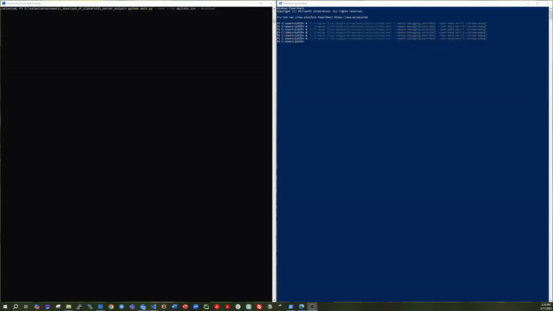

# AlphaFold 3 Downloader

A Python utility to automatically download structural data from the [AlphaFold 3 server](https://alphafoldserver.com/).

Even though the AlphaFold 3 code has been released, installing and running it can be challenging for many users. Moreover, if you need to download more than 100 structures, doing it manually is tedious. This script automates the process by:

- Connecting to an already-running instance of Google Chrome in remote debugging mode.
- Extracting download links by interacting with the page.
- Optionally saving the list of links to a CSV file.
- Downloading each file (with delays between downloads).

This project is designed for Windows, but it can be easily adjusted for other platforms.

**Google Chrome in Remote Debugging Mode**

Before running the script, start Chrome with remote debugging enabled. In Windows PowerShell, run:

```powershell
& "C:\Program Files\Google\Chrome\Application\chrome.exe" --remote-debugging-port=9222 --user-data-dir="C:\chrome-debug"
```

Then, log in to your Google account in the opened Chrome window.

**Environment**

For setting up the environment please use the provided environment.yml file. Please, replace 'YOUR_NAME' and 'YOUR_PATH' with your specific information.

The environment could be installed using environment.yml file and next command:

```
conda env create -f environment.yml
```

**Usage**

Run the script from the command line:

```bash
python main.py [--save] [--csv CSV_PATH] [--download]
--save
Save the extracted download links to a CSV file (default: links.csv).

--csv CSV_PATH
Specify a different path for the CSV file.

--download
Download the files after extracting the links.

```
Example (to save links and download files):

```bash
python main.py --save --csv mylinks.csv --download
```

The script will:
- Connect to the running Chrome session.
- Open AlphaFold 3 server.
- Wait for you to log in with your Google account.
- Extract all download links by clicking the “more_vert” buttons.
- Optionally save the links and download the files.

The demonstration with downloading 10 links could be found here:

